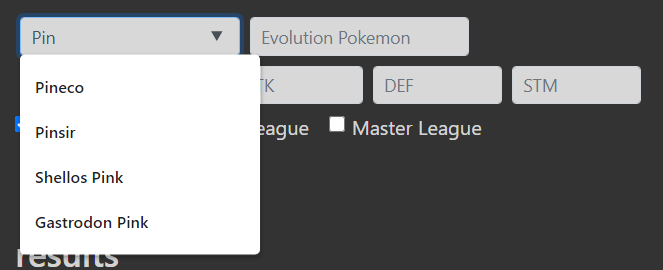
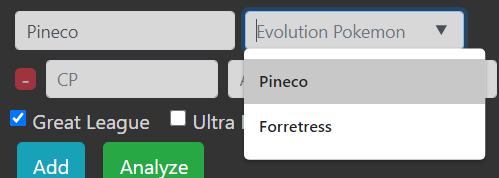
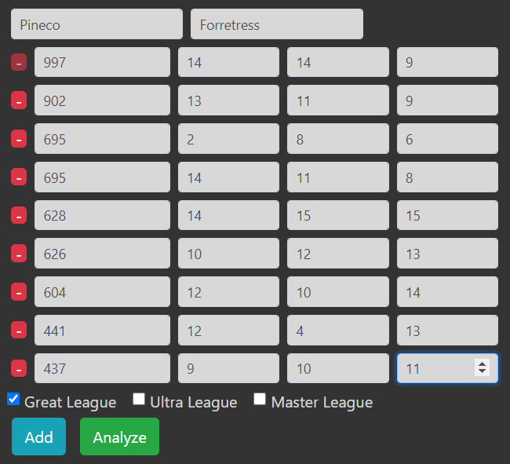
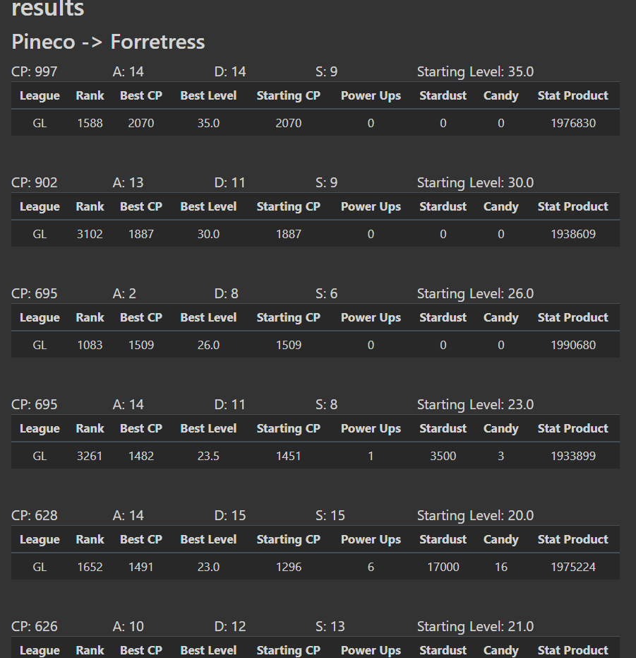
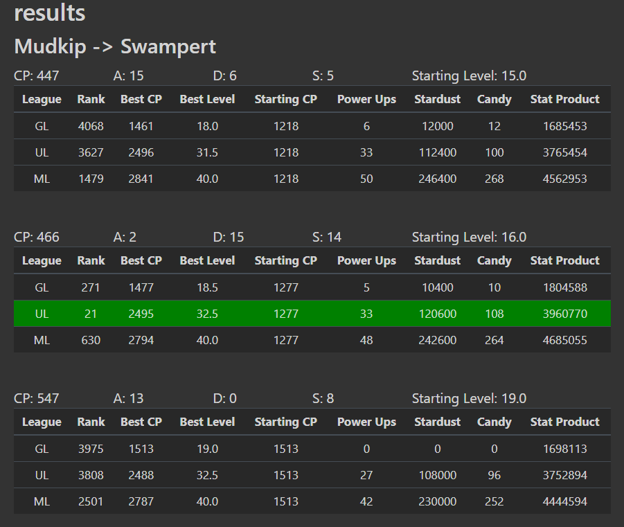

# Pokemon Go PVP Rank & Power Up Cost Calculator 
## Django, Python, PostgreSQL web app
By Judy Kim 

https://fullstack-pvp.herokuapp.com/

## Technologies Used
* Django
* Python3
* PostgreSQL
* Bootstrap 4

## Screenshots

Autocomplete search for Pokemon  
 

Autocomplete for Evolutions  
 

Endless form to analyze multiple Pokemon at once  
 

Results for Great League  
 

Results for all Leagues  
 

## Features
* Batch analysis of multiple Pokemon of the same species
* Endless input form - a new input row is created when the user presses tab in the last field and that field has been filled out. This condition prevents empty rows from being created unnecessarily.
* Client-side form validation - input types and values are checked and flagged as being invalid, which prevents the user from submitting the form.
* Pokemon search autocomplete - database queries are made on each key press via a fetch request, and the select menu is populated with matches.
* Evolution Pokemon look-up and autocomplete - once the Pokemon is chosen, a search is done for all possible evolutions. The results are then used to populate the select menu with options.

## Future Work
* Lucky Pokemon stardust discount
* Shadow & Purified stardust cost difference
* Condensed output format

## Data Models
1. Base Stats
2. PVP Stats for each league
    * The 4096 stats for each league are stored in a dictionary as a Pickled Field Object
    * Each Pokemon has its own table of PVP Stats
3. Evolutions

## Installation
* Install PostgreSQL from https://www.postgresql.org/download/macosx/
* Install virtualenv https://packaging.python.org/en/latest/guides/installing-using-pip-and-virtual-environments/
python3 -m venv .venv
source .venv/bin/activate
* Add pg_config to PATH in ~/.bashrc (for example..)
export PATH=$PATH:/Library/PostgreSQL/17/bin
* Also add the SECRET_KEY to in ~/.bashrc
* Make sure to add it to .venv PATH
source ~/.bashrc
* Install requirements
pip install -r requirements.txt

# Creating and Connecting to the PostgreSQL 17 server on Mac
sudo mkdir -p /usr/local/var/postgres
sudo chown `whoami` /usr/local/var/postgres
pg_ctl initdb -D /usr/local/var/postgres
* Had to kill postgres because I couldn't connect to port 5432
sudo pkill -u postgres
* start the server in directory specified
pg_ctl start -D /usr/local/var/postgres

# Create the pvp_db database
createdb pvp_db

## Development

# Run the development server
python manage.py runserver
* Run on a specific server
python manage.py runserver 8001

# Management commands
python manage.py update_base_stats
python manage.py update_evolution_table
python manage.py update_constants
* If necessary, wipe out existing calculations of stat products
python manage.py delete_league_stat_tables

# Heroku
* Log into Heroku, use Salesforce authenticator app
heroku login
* Deploy
git push heroku master
* Open Heroku's console
heroku run bash
exit

